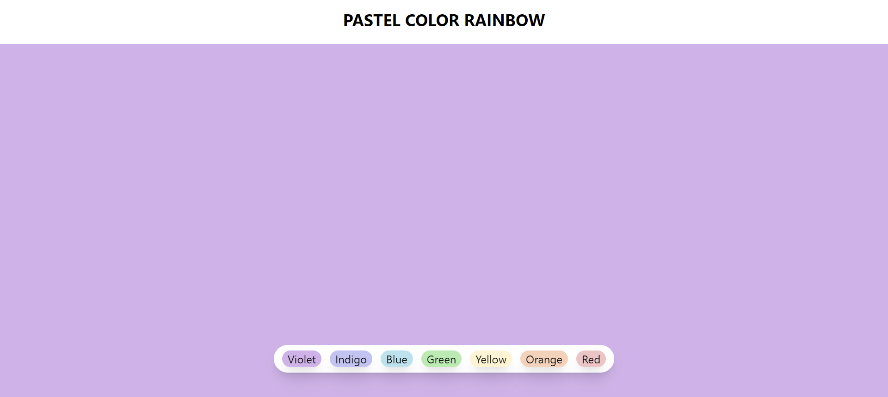

# Pastel Color Rainbow App



## Description

The Pastel Color Rainbow App is a simple React-based web application that allows users to change the background color of the page by selecting from a range of beautiful pastel colors. It's a fun and interactive way to explore and enjoy different color combinations.

## Features

- Change the background color of the page with a click of a button.
- Choose from a variety of pastel colors.
- User-friendly and visually appealing interface.

## Technologies Used

- React
- JavaScript
- Tailwind CSS

## Installation

1. Clone the repository:

   ```bash
   git clone https://github.com/kratin01/Background-changer.git
